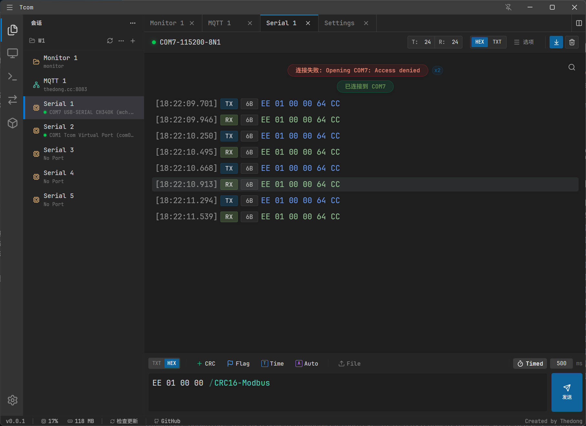
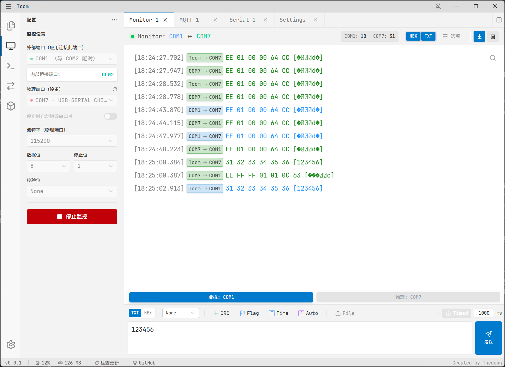

# Tcom 🚀
A powerful, modern serial and protocol assistant.

[](https://github.com/thedongcc/Tcom/releases)
[](https://github.com/thedongcc/Tcom/actions/workflows/build.yml)
[](https://opensource.org/licenses/MIT)

**Tcom** 是一款专为开发者打造的、高性能、极具现代感的全能型串口调试与协议辅助工具。它突破了传统串口工具的 UI 限制，集成了现代化的开发体验与强大的协议调试功能。

---

## 📸 界面预览

| 深色模式 (Dark Mode) | 浅色模式 (Light Mode) |
| :--- | :--- |
|  |  |

---

## ✨ 核心功能

- **📟 串口通讯 (Serial Port)**
  - 支持所有标准波特率及自定义波特率设置。
  - 实时 RX/TX 字节统计。
  - 支持数据流渲染、Hex/Text/Both 展示模式。
  - 强大的日志搜索与正则匹配功能。

- **🌐 MQTT 通讯**
  - 内置 MQTT 客户端，支持多主题订阅与发布。
  - 消息 Payload 自动格式化（JSON、XML、Text）。
  - 支持 QoS 配置、Retain 消息及持久化连接设置。

- **🌉 虚拟串口桥接 (Virtual Port Monitor)**
  - **核心特色**：集成 `com0com` 驱动管理。
  - 允许在物理串口与虚拟串口之间建立桥接，实现对任意第三方串口软件通讯数据的实时监控与拦截调试。

- **🗂️ 命令库管理**
  - 分级组织常用指令，支持一键发送、批量发送。
  - 支持多语言、多编码（UTF-8, GBK, ASCII）环境。

---

## ⚡ 核心特性

- **现代 UI 体验**：基于 VSCode 风格设计，支持深浅主题切换，提供极致流畅的交互体验。
- **高性能渲染**：采用虚拟列表与位图组合渲染技术，轻松应对万级大数据量日志不卡顿。
- **跨平台支持**：基于 Electron + React 构建，无缝运行在 Windows 系统（深度优化）。
- **插件化扩展**：灵活的插件架构，易于扩展更多自定义协议与调试视图。
- **Vibe Coding 产物**：本软件是 AI 协作开发的结晶，兼具开发效率与前沿技术方案。

---

## 🛠️ 技术栈

| 领域 | 技术方案 |
| :--- | :--- |
| **基础框架** | [Electron](https://www.electronjs.org/), [React 18](https://react.dev/) |
| **状态管理** | Context API & Custom Hooks |
| **构建工具** | [Vite](https://vitejs.dev/), [Electron Builder](https://www.electron.build/) |
| **样式方案** | Vanilla CSS (Themed) |
| **图标系统** | [Lucide React](https://lucide.dev/) |
| **开发语言** | [TypeScript](https://www.typescriptlang.org/) |

---

## 🚀 快速开始

### 安装使用
在 [Releases](https://github.com/thedongcc/Tcom/releases) 页面下载最新版本的 `Tcom-Setup-x.x.x.exe`。

### 本地开发
```bash
# 克隆项目
git clone https://github.com/thedongcc/Tcom.git

# 安装依赖
npm install

# 启动开发服务器
npm run dev
```

---

## 🤝 贡献与反馈
欢迎通过 Issue 提供建议或通过 Pull Request 贡献代码。

**Author**: [@thedongcc](https://github.com/thedongcc)  
**License**: [MIT](LICENSE)

---

## ☕ 赞赏支持

如果本项目对您有所帮助，欢迎赞赏支持！

<div align="left">
  
  
</div>
